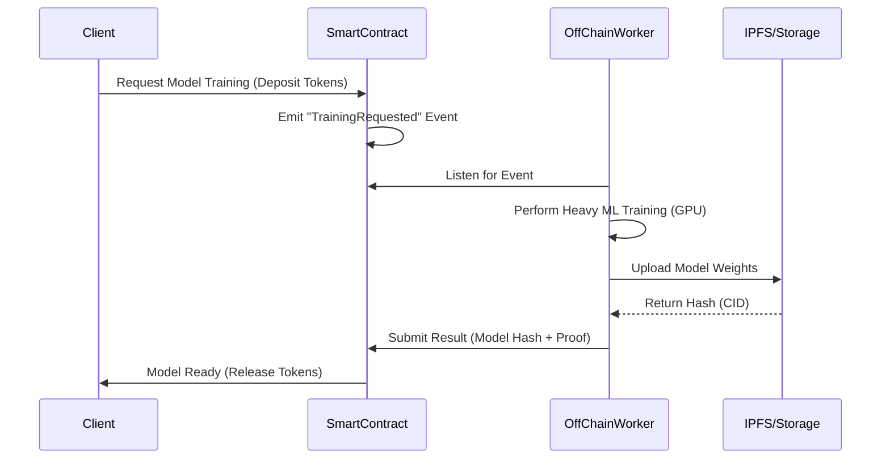

---

**Editor's Note on Distributed Intelligence**

Blockchain and Machine Learning are often discussed as separate revolutions, but their intersection offers a solution to the "black box" problem in AI. This article explores how we can move model coordination on-chain while keeping heavy computation off-chain, a hybrid architecture that finally makes "Proof-of-Useful-Work" a reality.

Blockchain technology and machine learning (ML) have traditionally evolved on parallel tracks. However, recent research shows that their convergence promises **transparent, trustworthy, and decentralized intelligent systems**. In our survey on blockchain-enhanced machine learning [1], we examine how the decentralized design of blockchain can address systemic challenges in ML and pave the way for collaborative, verifiable artificial intelligence.

## Why Blockchain Matters for ML

1. **Auditability and provenance:** Blockchains provide immutable ledgers that record every action in model development pipelines. Training data, model updates, and inference requests can be cryptographically traced, mitigating data poisoning or tampering.
2. **Decentralized governance:** Smart contracts enable community-driven governance of datasets and models. Stakeholders can vote on dataset curation, model releases, or access policies without centralized authorities.
3. **Incentive alignment:** Token rewards transform data contribution and model training into economically incentivized activities, encouraging high-quality participation in open ML ecosystems.

## Core Architectural Patterns

Our survey identifies three canonical architectures for combining blockchain with ML. The most promising for scalability is the **On-chain coordination, Off-chain computation** pattern:

1. **On-chain coordination, off-chain computation:** Lightweight smart contracts log events and manage access control while heavy model training occurs off-chain. This pattern balances transparency with scalability and suits federated learning or model marketplaces.
2. **Proof-of-Useful-Work:** Instead of wasteful hashing, miners perform ML training or inference to secure the blockchain. The result is a consensus mechanism where useful computation replaces traditional mining, linking network security with ML progress.
3. **Decentralized data exchanges:** Blockchains act as registries and payment rails for dataset access, encouraging sharing while preserving ownership. Zero-knowledge proofs or differential privacy guard sensitive information.

## Applications in the Wild

1. **Federated learning with trusted aggregation:** Each participant's model update is committed to a blockchain, ensuring traceability and deterring malicious clients.
2. **Model marketplaces:** Developers publish models with verifiable training histories. Consumers can audit provenance before purchasing, fostering reusable AI components.
3. **Edge and IoT analytics:** Devices share encrypted features or model outputs through blockchain-based publish/subscribe systems, enabling secure cooperative analytics at scale.

## Challenges and Open Questions

Despite the promise, integrating blockchain and ML introduces nontrivial challenges:

1. **Scalability:** Public blockchains struggle with throughput and latency. Layer-2 solutions or permissioned chains can alleviate bottlenecks but complicate interoperability.
2. **Privacy:** Public ledgers conflict with confidential ML workflows. Techniques such as homomorphic encryption, secure multiparty computation, or trusted execution environments help, but remain resource intensive.
3. **Standardization:** The ecosystem lacks common interfaces for deploying models, verifying training claims, or exchanging tokens across networks.
4. **Energy consumption:** Proof-of-Useful-Work schemes must guarantee that their ML outputs are genuinely valuable to offset the energy costs of consensus.

## Looking Ahead

Research continues to explore hybrid approaches that maintain decentralization without sacrificing performance. Cross-chain messaging, sharding, and hierarchical consensus may support global ML collaborations. Privacy-preserving cryptographic primitives are maturing, enabling verifiable yet confidential training. Economic mechanisms such as staking or slashing could discourage malicious behavior in decentralized learning networks.

Our survey [1] concludes that **blockchain-enhanced ML is poised to reshape how data and models are shared, validated, and monetized**. As regulation and ethical guidelines demand greater accountability, blockchain offers a path to verifiable AI pipelines. Future systems may feature:

1. Tokenized incentives for dataset curation and model validation.
2. Distributed audit logs linking every model to its training evidence.
3. Modular consensus layers that execute ML tasks as part of securing the network.

By marrying blockchain's transparency with machine learning's predictive power, we can build AI systems that are not only intelligent but also accountable and economically sustainable.

## References

[1] Ural, O. and Yoshigoe, K. (2023). *Survey on Blockchain-Enhanced Machine Learning*. IEEE Access.

---
*Dr. Ozgur Ural is a Senior Software Engineer & Researcher specializing in Secure Distributed Systems. This article is based on his Ph.D. research into the intersection of Cryptography and Machine Learning.*
